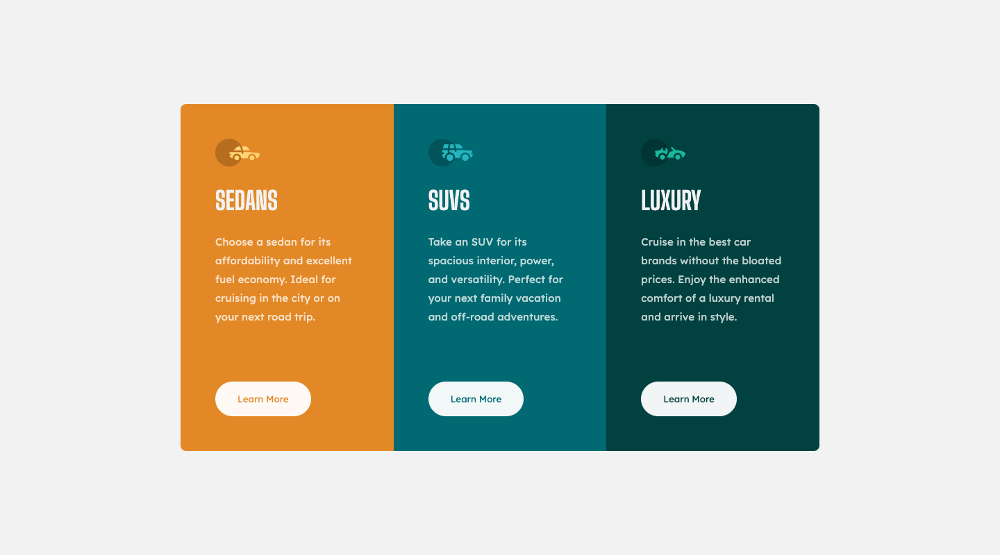

# Frontend Mentor - 3-column preview card component solution

### Design Preview

This is a solution to the [3-column preview card component challenge on Frontend Mentor](https://www.frontendmentor.io/challenges/3column-preview-card-component-pH92eAR2-). Frontend Mentor challenges help you improve your coding skills by building realistic projects. 

## Table of contents

- [Overview](#overview)
  - [The challenge](#the-challenge)
  - [Screenshot](#screenshot)
  - [Links](#links)
- [My process](#my-process)
  - [Built with](#built-with)

## Overview

### The challenge

- Build out the project to the designs provided

### Screenshot

### Links

- Solution URL: [https://github.com/sjneri/preview-card](https://github.com/sjneri/preview-card)
- Live Site URL: [https://sjneri.github.io/preview-card/](https://sjneri.github.io/preview-card/)

## My process

### Built with

- Semantic HTML5 markup
- CSS custom properties
- Flexbox